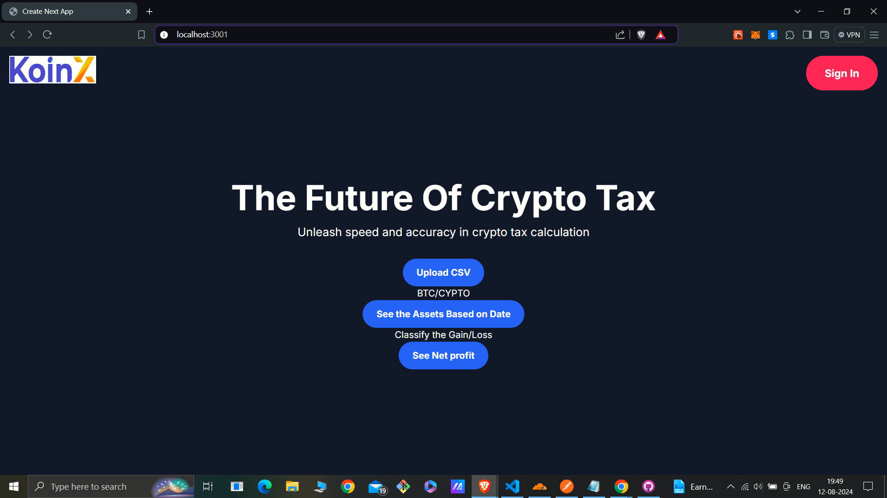

## Koinx

# First Assignment continuation

This Project is designed to calculate the cost basis and net profit for cryptocurrency transactions along with number of Assets based on time stamp . It processes transaction data stored in a MongoDB database and generates detailed Trade Details. The project is built using Next.js, TypeScript, and MongoDB,Node js for the backend and it integrates file uploads with multer and authentication using NextAuth.



## Features

- **Asset Balance Calculation**: Retrieve the balance of assets like BTC, MATIC, etc., at any specified timestamp.
- **Mongoose Integration**: Uses Mongoose to connect to a MongoDB Atlas database.
- **CSV Data Import**: Import transaction data from CSV files into the MongoDB database.

## Prerequisites

- **Node.js**: Make sure you have Node.js installed (v14.x or later).
- **MongoDB Atlas**: This project uses a MongoDB Atlas cluster. Ensure you have a MongoDB Atlas account and cluster set up.

  ## Backend set up

## Installation

1. **Clone the Repository**:

   ```bash
   git clone https://github.com/ashish07-07/Koinx-report

   ```

2. **Install Dependencies**:

   ```bash
   npm install
   ```

3. **Set Up Environment Variables**:
   Create a `.env` file in the root directory and add the following:

   ```env
   MONGODB_URI="your_mongodb_connection_string"
   ```

4. **Build the Project**:

   ```bash
   npm run build
   ```

5. **Run the Project**:

   ```bash
   npm start
   ```

## Databse snapshot


## Usage

### API Endpoint

    

- **POST /http://localhost:3000/asset/balencesummary**

  - Request:
    ```json
    {
      "timestamp": "2022-09-28 12:00:00"
    }
    ```
  - Response:

    ```json
    {
      "BTC": 15,
      "MATIC": 100
    }
    ```

    

### Example


## Project Structure

- **src/**
  - `index.ts`: Entry point of the application.
  - `routes/`: Contains the API route handlers.
  - `db/schema.ts`: Defines the Mongoose schema for the transactions.
